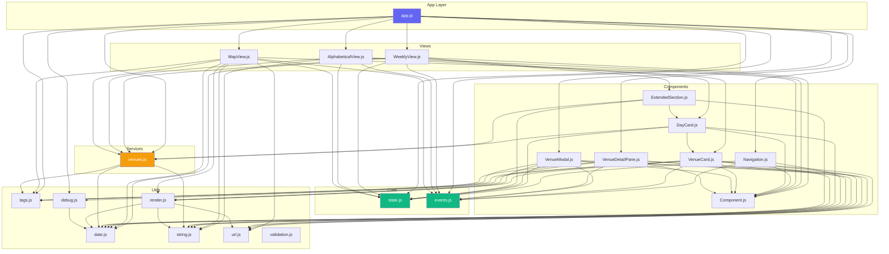
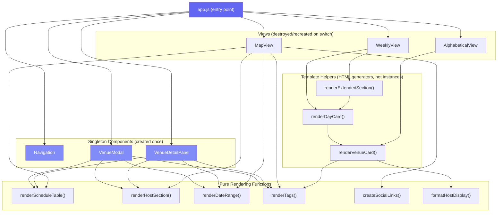
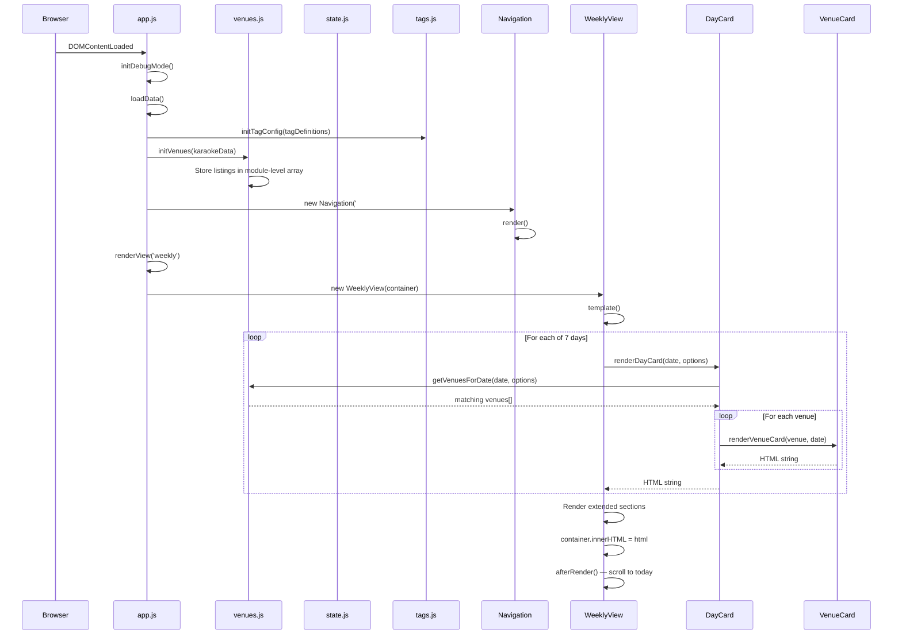
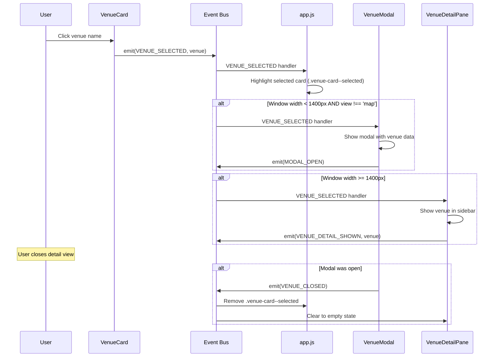
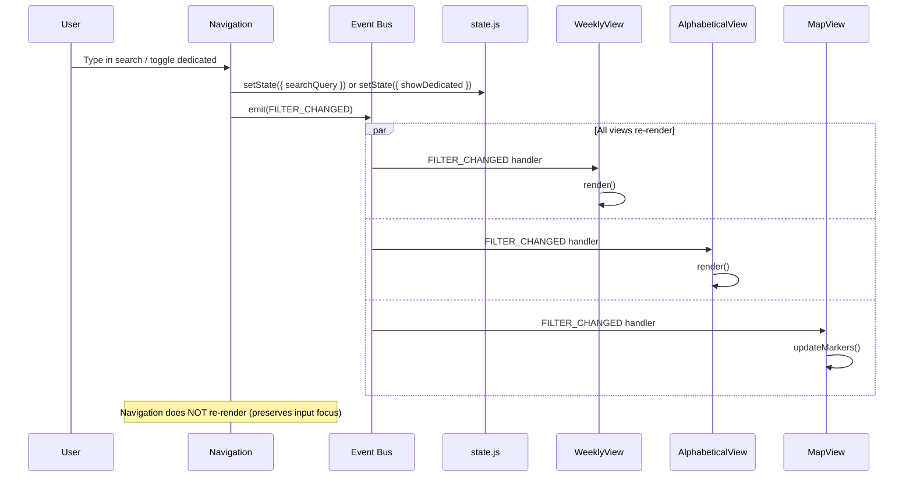
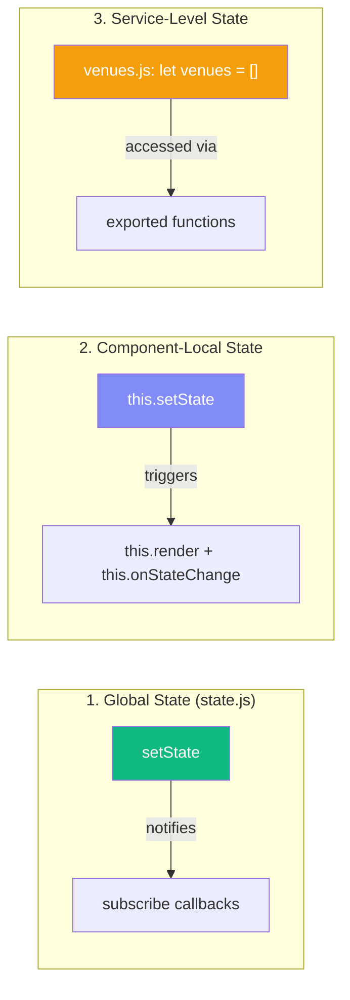
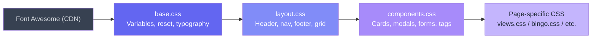
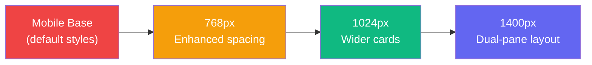

# Architecture Reference

> Visual guide to the Austin Karaoke Directory codebase. Diagrams are rendered via Mermaid.js in the Docsify portal.

---

## 1 Module Dependency Graph

The application is organized into five layers. Dependencies flow downward — upper layers import from lower layers, never the reverse.



### Leaf Modules (No Local Imports)

These utility modules have zero imports from the project — they depend only on browser APIs:

| Module | Purpose |
|--------|---------|
| `js/core/state.js` | Centralized state with observer pattern |
| `js/core/events.js` | Pub/sub event bus |
| `js/utils/date.js` | Date formatting, schedule matching |
| `js/utils/string.js` | Text manipulation, escaping |
| `js/utils/url.js` | URL building, sanitization |
| `js/utils/tags.js` | Tag config and rendering |
| `js/utils/validation.js` | Form validation |

### Modules With Local Imports

| Module | Imports From |
|--------|-------------|
| `js/utils/render.js` | string.js, date.js, url.js |
| `js/utils/debug.js` | date.js |
| `js/services/venues.js` | date.js, string.js, tags.js |

---

## 2 Component Hierarchy



### Component Types

| Type | Lifecycle | Examples |
|------|-----------|---------|
| **Singleton** | Created once in `app.js init()`, persists for entire session | Navigation, VenueModal, VenueDetailPane |
| **View** | Created on view switch, destroyed when switching away | WeeklyView, AlphabeticalView, MapView |
| **Template helper** | Function that creates a temporary Component instance, calls `template()`, returns HTML string — no persistent state | `renderDayCard()`, `renderVenueCard()`, `renderExtendedSection()` |
| **Pure function** | Stateless function that returns an HTML string from data | `renderScheduleTable()`, `renderTags()`, `createSocialLinks()` |

### Template Helper Pattern

DayCard, VenueCard, and ExtendedSection export both a `class` and a `render*()` function. The render function is used by parent views to generate HTML without managing component instances:

```javascript
// In DayCard.js
export function renderDayCard(date, options) {
    const card = new DayCard(document.createElement('div'), { date, ...options });
    return card.template();
}
```

The parent view calls `renderDayCard()` inside its own `template()` method, concatenates the returned HTML strings, then injects the combined result into the DOM.

---

## 3 Data Flow: Page Load to Render



---

## 4 Event Lifecycle Map

### All Events

| Event Constant | String | Emitted By | Listened By | Payload |
|---------------|--------|------------|-------------|---------|
| `VENUE_SELECTED` | `venue:selected` | app.js, VenueCard, WeeklyView, AlphabeticalView | app.js, VenueModal, VenueDetailPane | venue object |
| `VENUE_CLOSED` | `venue:closed` | VenueModal | app.js, VenueDetailPane | — |
| `VENUE_DETAIL_SHOWN` | `venue:detail-shown` | VenueDetailPane | — | venue object |
| `VIEW_CHANGED` | `view:changed` | Navigation, MapView | — | view name string |
| `WEEK_CHANGED` | `week:changed` | Navigation | — | — |
| `FILTER_CHANGED` | `filter:changed` | Navigation, MapView | WeeklyView, AlphabeticalView, MapView | — |
| `SEARCH_CHANGED` | `search:changed` | — | — | _(defined but unused)_ |
| `MODAL_OPEN` | `modal:open` | VenueModal | — | — |
| `MODAL_CLOSE` | `modal:close` | — | VenueModal | _(defined but unused as emitter)_ |
| `DATA_LOADED` | `data:loaded` | app.js | — | karaokeData object |
| `DATA_ERROR` | `data:error` | app.js | — | error object |

### Venue Selection Flow



### Filter Change Flow



---

## 5 State Management

### State Keys

| Key | Type | Default | Writers | Readers | Subscribers |
|-----|------|---------|---------|---------|-------------|
| `venues` | array | `[]` | app.js (via initVenues) | venues.js | — |
| `filteredVenues` | array | `[]` | — | — | — |
| `filters` | object | `{...}` | — | — | — |
| `view` | string | `'weekly'` | Navigation, MapView, app.js | Navigation, MapView | app.js → renderView() |
| `weekStart` | Date | today | Navigation | WeeklyView, Navigation | WeeklyView → render(), Navigation → render() |
| `showDedicated` | boolean | `true` | Navigation, MapView | All views, Navigation | WeeklyView, AlphabeticalView, MapView, Navigation |
| `searchQuery` | string | `''` | Navigation | All views (via getVenuesForDate/getVenuesSorted) | — _(uses FILTER_CHANGED event instead)_ |
| `selectedVenue` | object/null | `null` | VenueModal, VenueDetailPane | — | — |
| `isLoading` | boolean | `false` | — | — | — |

### Three Mutation Patterns



| Pattern | Where | How | Cleanup |
|---------|-------|-----|---------|
| **Global** | `state.js` | `setState({key: value})` triggers `subscribe(key, cb)` | Via `Component.subscribe()` auto-cleanup |
| **Component-local** | `Component.setState()` | `this.setState({...})` merges into `this.state`, calls `render()` + `onStateChange()` | Cleared on `destroy()` |
| **Service-level** | `venues.js` | Module-scoped `let venues = []`, mutated by `initVenues()`, read by all query functions | Lives for page lifetime |

### Subscription Auto-Cleanup

Components use `this.subscribe()` to register unsubscribe functions. On `destroy()`, all stored functions are called automatically:

```javascript
// In a component's init() method:
this.subscribe(subscribe('weekStart', () => this.render()));
this.subscribe(on(Events.FILTER_CHANGED, () => this.render()));

// Component.subscribe() stores the unsubscribe function:
subscribe(subscribeFn) {
    this._subscriptions.push(subscribeFn);
}

// Component.destroy() calls them all:
destroy() {
    this._subscriptions.forEach(fn => fn());
    this._subscriptions = [];
}
```

---

## 6 CSS Architecture

### Loading Order

Every page loads CSS in this specific order. Later files override earlier ones.



### Page CSS Requirements

| Page | CSS Files (in order) |
|------|---------------------|
| `index.html` | base, layout, components, views |
| `about.html` | base, layout, components, views |
| `submit.html` | base, layout, components, views, submit |
| `bingo.html` | base, layout, components, bingo |
| `editor.html` | base, layout, components, editor |
| `codeexplained.html` | base, layout, components, docs |

### CSS Variable Hierarchy

All variables defined in `base.css`:

| Category | Examples | Usage |
|----------|---------|-------|
| **Colors** | `--color-primary`, `--color-secondary` | Theme colors (indigo/purple palette) |
| **Backgrounds** | `--bg-card`, `--bg-body` | Surface colors |
| **Text** | `--text-primary`, `--text-muted` | Typography colors |
| **Borders** | `--border-color`, `--border-radius` | Consistent borders |
| **Spacing** | `--spacing-xs` through `--spacing-2xl` | Consistent spacing scale |
| **Typography** | `--font-size-sm` through `--font-size-2xl` | Font size scale |
| **Transitions** | `--transition-fast`, `--transition-normal` | Animation timing |

### Responsive Breakpoints



| Breakpoint | Key Changes |
|------------|-------------|
| **Base** (mobile) | Single column, modal for details, stacked nav |
| **768px** | Enhanced spacing, horizontal nav layout |
| **1024px** | Wider cards, more horizontal space |
| **1400px** | **Major shift** — dual-pane layout. VenueDetailPane sidebar appears. VenueModal suppressed. CSS grid: `1fr 400px` |

### BEM Naming Convention

Components use Block-Element-Modifier naming:

```
.venue-card                    /* Block */
.venue-card__header            /* Element */
.venue-card__name              /* Element */
.venue-card__more-nights       /* Element */
.venue-card--compact           /* Modifier */
.venue-card--special-event     /* Modifier */
.venue-card--selected          /* Modifier */

.day-card                      /* Block */
.day-card__header              /* Element */
.day-card__content             /* Element */
.day-card--today               /* Modifier */
.day-card--past                /* Modifier */
.day-card--empty               /* Modifier */
.day-card--expanded            /* Modifier */

.extended-section              /* Block */
.extended-section__header      /* Element */
.extended-section__content     /* Element */
.extended-section__dedup-notice /* Element */
.extended-section--collapsed   /* Modifier */
```

---

*This document is part of the [Austin Karaoke Directory documentation](functional-spec.md). See also [Code Patterns](patterns.md) for implementation recipes.*
